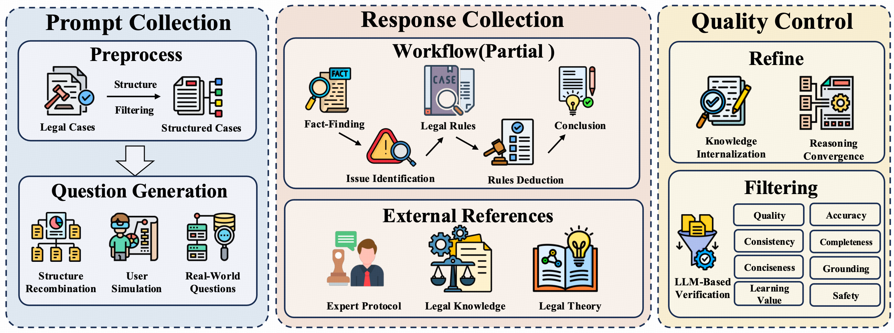

<p align="center">
  
</p>

<h1 align="center">
  Legal-R1: A Family of Legal Foundation Models for Reliable Legal Reasoning
</h1>

<p align="center">
  <a href="https://arxiv.org/abs/" target="_blank">
    
  </a>
  <a href="https://your-website.com" target="_blank">
    
  </a>
  <a href="https://huggingface.co/your-org/Legal-R1-1.7B" target="_blank">
    
  </a>
  <a href="https://huggingface.co/your-org/Legal-R1-4B" target="_blank">
    
  </a>
  <a href="https://huggingface.co/your-org/Legal-R1-8B" target="_blank">
    
  </a>
  <a href="https://huggingface.co/datasets/your-org/legal-dataset" target="_blank">
    
  </a>
  <a href="https://github.com/your-org/LegalKit" target="_blank">
    
  </a>
</p>

<p align="center">
  <a href="README.md">📖 English</a> | <a href="README_CN.md">📖 中文</a>
</p>

---

## 概述

近年来，法律领域对可靠AI系统的需求快速增长。然而，法律推理既**知识密集**又**结构密集**，通用LLM往往存在法律知识理解不足、推理与实践脱节等问题，难以满足法律系统对可靠性的要求。

**Legal-R1** 是一系列专门为中文法律领域训练的LLM，采用**多阶段训练框架**来联合增强法律知识和推理能力。模型基于 **昇腾 Atlas 910B** 计算平台与 **昇思 MindSpore** AI 框架完成训练。

- **中期训练**：基于困惑度的课程学习，从广泛、异构的通用数据平滑过渡到专业化法律任务，在有效注入法律知识的同时避免灾难性遗忘
- **监督微调**：通过多智能体系统提炼结构化的法律推理流程，培养模型执行可靠推理的能力
- **强化学习**：采用多阶段课程学习，从简单到复杂逐步塑造推理能力，形成更内化、更自主的"法律思维"模式

<p align="center">
  
</p>

**Legal-R1-8B** 在**法规解释、判例法推理、法律问答、文档起草**等任务上超越通用 LLM 和现有法律模型。在 **LexEval、LewBench、JecQA** 等权威评测中，整体性能可媲美更大参数规模的通用模型（如 **DeepSeek-R1、Qwen3-Max**），并在部分任务上实现超越。尤其在**法律概念理解、法条记忆、多跳推理**等关键任务上，**Legal-R1-8B** 达到了当前开源模型的**领先水平**。

---

## 模型系列

### Model Access

| 模型 | 参数量 | 基座模型 | 支持语言 | 链接 |
|-------|-----------|------------|---------------------|------|
| Legal-R1-1.7B | 1.7B | Qwen3-1.7B-Base | 中文 & 英文 | [HF Link](#) |
| Legal-R1-4B | 4B | Qwen3-4B-Base | 中文 & 英文 | [HF Link](#) |
| Legal-R1-8B | 8B | Qwen3-8B-Base | 中文 & 英文 | [HF Link](#) |

本次发布包含 1.7B、4B 和 8B 三个参数规模的模型，覆盖从轻量级部署到高性能应用的不同场景需求。随着算力资源的持续扩充，我们计划在未来推出更大规模的模型版本，进一步提升法律推理的深度与广度。

### 部署方法

Legal-R1 可以像普通的 Qwen3 模型一样使用。你可以使用 [vLLM](https://github.com/vllm-project/vllm) 或 [Sglang](https://github.com/sgl-project/sglang) 等工具进行部署，也可以直接使用 transformers 进行推理：

```python
from transformers import AutoModelForCausalLM, AutoTokenizer

model = AutoModelForCausalLM.from_pretrained(
    "your-org/Legal-R1-8B",
    torch_dtype="auto",
    device_map="auto"
)
tokenizer = AutoTokenizer.from_pretrained("your-org/Legal-R1-8B")

input_text = "请根据以下提供的案件事实，从法律角度进行分析，并预测法院可能作出的判决。[案件描述]"
messages = [{"role": "user", "content": input_text}]

inputs = tokenizer(
    tokenizer.apply_chat_template(
        messages,
        tokenize=False,
        add_generation_prompt=True
    ),
    return_tensors="pt"
).to(model.device)

outputs = model.generate(**inputs, max_new_tokens=2048)
print(tokenizer.decode(outputs[0], skip_special_tokens=True))
```

Legal-R1 采用"先思考后回答"的方式，输出格式如下：

```
<think>
思考过程
</think>
[最终回答]
```

---

## 数据

我们致力于推动法律人工智能研究的开放与共享。在对数据进行严格清洗以确保合规性之后，我们将逐步开源部分高质量数据集，为法律社区的发展贡献力量。敬请期待！

### 中期训练语料

Legal-R1 的中期训练采用精心构建的混合语料库，整合通用数据、法律数据和合成数据三大类，总计约 100B tokens，为模型提供扎实的知识基础。

#### 数据组成

**通用数据**：构建坚实的通用知识底座
- 整合 FinWeb-Edu、FinePDFs、FineWiki、SkyPile-150B、IndustryCorpus、OpenNewsArchive、MathPile、Wanjuan、BaiduBaike-5.63M 等高质量开源语料
- 在法律专业化训练中有效缓解灾难性遗忘，保持模型的通用语言理解能力与广博的世界知识

**法律数据**：注入专业领域知识
- 数据来源：涵盖学术论文、法律评论、法律注释、法律咨询、法院判决、司法意见、法律教材、法律百科、指导意见、法律法规等多维度法律文本
- 时效性控制：严格筛选近5年的法律文档，仅保留现行有效的法规条文

**合成数据**：增强推理表达能力，提升 token 训练效率
- **推理数据**：依托 Qwen3-255B-A22B-Thinking 从权威法律源生成专家级、多角度推理样本，借鉴费曼技巧进行结构化分析拆解
- **改写数据**：通过精心设计的提示词生成多种写作风格和视角的忠实改写，有效提升每个 token 的学习信号密度

#### 质量控制

我们建立了完善的多阶段数据质量控制体系，通过去重、启发式过滤、困惑度筛选及语言约束四重保障，最终获得约 100B tokens 的高质量中期训练语料。

### 监督微调数据

监督微调的常规做法是使用通用大语言模蒸馏型。然而在法律领域，即使是最先进的通用模型，在事实准确性、法律适用性和论证严谨性方面也暴露出显著缺陷。直接蒸馏其输出不仅会传播并放大这些错误与偏差，更会对法律大模型的可靠性与安全性构成严重威胁。

我们观察到真实法律案例文档天然编码了丰富的社会事实、核心争议焦点和结构化法律推理，本质上极具监督价值。然而，这类文档通常在终审判决后才撰写，且面向专业读者，导致大量底层推理过程被高度压缩或省略。关键中间步骤——如识别关键事实和明确争议焦点——往往未得到明确表述。当底层逻辑隐藏于专业表达之后，模型便难以习得清晰可迁移的推理链条。

为系统性地获得高质量的法律思维链数据，我们开发了法律智能体 CoT 蒸馏管道。该流程包含三个阶段：

1. **提示词收集**：提示词来源涵盖三个维度——文书结构化提取（从真实法律文档中提取结构化知识）、用户模拟（模拟真实用户咨询场景）、真实世界（收集实际法律应用场景），构建高质量的多样化提示词模板
2. **响应收集**：我们避免要求大模型直接完成复杂法律任务，而是将其分解为一系列更简单、可解释的子步骤，让模型分步完成。每个阶段都配置定制化提示和外部知识支持，将全局性法律推理转化为局部的、可控的子问题。
3. **质量控制**：我们使用大模型对思维链进行知识内化和推理合成，得到最终的高质量思维链。之后采用 LLM-as-Judge 范式进行多维度评估，从事实准确性、法律适用性、逻辑严谨性等角度确保生成内容的可靠性和实用性

<p align="center">
  
</p>

#### 数据规模

基于高质量法律文书，通过智能体 CoT 蒸馏管道，我们合成了涵盖法律咨询、判决预测、法律摘要、法律适用、文书生成等多种经典司法场景的数据。同时，结合部分开源的通用指令遵循数据以保持模型的通用能力，最终获得 **500k** 高质量监督微调数据，为模型培养结构化的法律推理能力，并为后续强化学习奠定坚实基础。

### 强化学习数据

我们收集并合成了一批适合法律领域进行强化学习的任务，涵盖从基础记忆到高级推理的完整能力谱系。这些强化学习任务具有可验证性，能够提供明确的奖励信号，指导模型通过强化学习逐步提升法律推理能力。通过从记忆到理解再到推理的渐进式训练，模型形成了更内化、更自主的法律思维模式。


## 实验结果

为确保评测结果的可复现性与透明度，我们推出了 **[LegalKit](https://github.com/DavidMiao1127/LegalKit)** 评测工具包，所有实验结果均基于 LegalKit 评测得出。

**LegalKit**是一个实用且可扩展的法律领域大模型评测工具包，统一了以下流程：数据集适配、模型生成、离线 JSON 评测、LLM-as-Judge 评审，同时提供可选的轻量级 Web UI，方便非命令行用户操作。欢迎使用！


## 引用

如果你觉得这项工作有用，请引用：

```bibtex
@misc{legal-r12025,
  title={Legal-R1: A Family of Legal Foundation Models for Reliable Legal Reasoning},
  author={Legal-R1 Team},
  year={2025},
  url={https://github.com/your-org/Legal-R1}
}
```

---

---

## 许可证

本项目采用 Apache 2.0 许可证 - 详见 LICENSE 文件。

---

## 免责声明

**Legal-R1** 是基于深度学习技术构建的法律大语言模型，旨在为法律研究和应用提供辅助工具。模型可以提供有价值的法律信息分析和推理参考，但**不应视为法律专业人士的替代品**。

在重要的法律事务中，建议您咨询专业的法律顾问或律师。模型输出仅供参考，不构成正式的法律意见或建议。

## 联系方式

如果您对 Legal-R1 有任何疑问、建议或想法，欢迎加入我们的讨论。您可以：

- 提交 GitHub Issue 报告问题或提出功能请求
- 发送邮件至 liht22@mails.tsinghua.edu.cn 进行技术讨论
- 参与社区讨论，分享您的见解和经验

我们衷心感谢您对 Legal-R1 项目的关注和参与！希望通过这个项目，能够为中文法律领域提供更智能、更可靠的解决方案。
