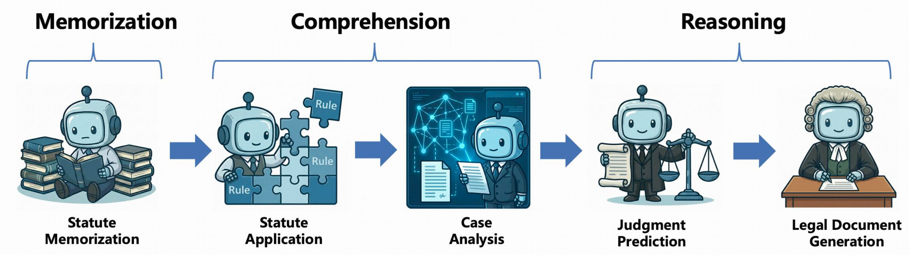
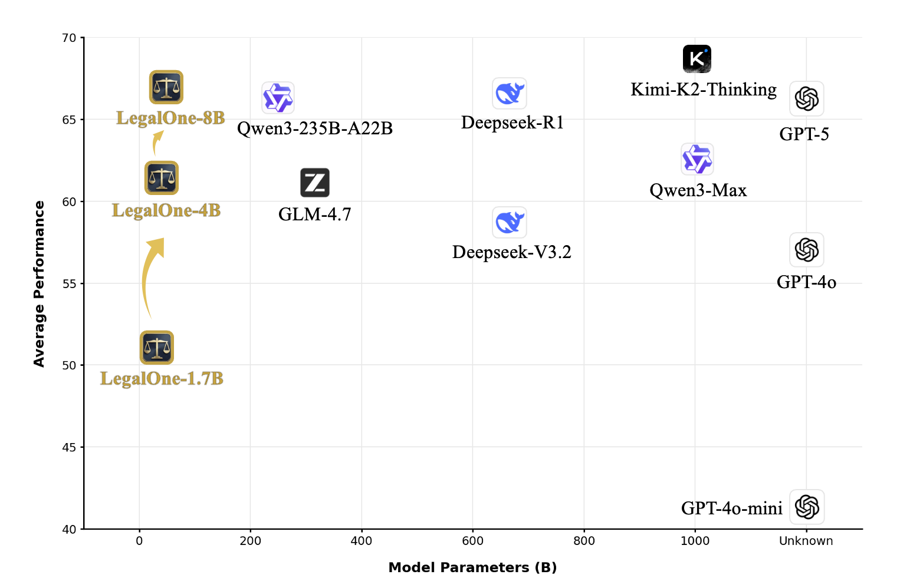

<p align="center">
  
</p>

<h1 align="center">
  LegalOne: A Family of Foundation Models for Reliable Legal Reasoning
</h1>

<p align="center">
  <a href="https://arxiv.org/abs/" target="_blank">
    
  </a>
  <a href="https://your-website.com" target="_blank">
    
  </a>
  <a href="https://huggingface.co/CSHaitao/LegalOne-1.7B" target="_blank">
    
  </a>
  <a href="https://huggingface.co/CSHaitao/LegalOne-4B" target="_blank">
    
  </a>
  <a href="https://huggingface.co/CSHaitao/LegalOne-8B" target="_blank">
    
  </a>
  <a href="https://huggingface.co/datasets/your-org/legal-dataset" target="_blank">
    
  </a>
  <a href="https://github.com/DavidMiao1127/LegalKit" target="_blank">
    
  </a>
</p>

<p align="center">
  <a href="README_EN.md">📖 English</a> | <a href="README.md">📖 中文</a>
</p>

---

## 概述

近年来，法律领域对可靠AI系统的需求快速增长。然而，法律推理既**知识密集**又**结构密集**，通用LLM往往存在法律知识理解不足、推理与实践脱节等问题，难以满足法律系统对可靠性的要求。

**LegalOne** 是一系列专门为中文法律领域训练的LLM，采用**多阶段训练框架**来联合增强法律知识和推理能力。模型基于 **昇腾 Atlas 910B** 计算平台与 **昇思 MindSpore** AI 框架完成训练。

- **中期训练**：基于困惑度的数据调度方法-Plasticity-Adjusted Sampling (PAS)，从广泛、异构的通用数据平滑过渡到专业化法律任务，在有效注入法律知识的同时避免灾难性遗忘。
- **监督微调**：我们建立了一个模拟专业法律工作流程的代理系统Legal Agentic CoT Distillation (LEAD)，能够综合大规模、高一致性的推理轨迹，培养模型执行可靠推理的能力。
- **强化学习**：采用多阶段课程学习，从简单到复杂逐步塑造推理能力，形成更内化、更自主的"法律思维"模式。


<p align="center">
  
</p>

**LegalOne-8B** 在**法规解释、判例法推理、法律问答、文档起草**等任务上超越通用 LLM 和现有法律模型。在 **LexEval、JecQA** 等权威评测中，整体性能可媲美更大参数规模的通用模型（如 **DeepSeek-R1、Qwen3-Max**），并在部分任务上实现超越。尤其在**法律概念理解、法条记忆、多跳推理**等关键任务上，**LegalOne-8B** 达到了当前开源模型的**领先水平**。


---

## 模型系列

### Model Access

| 模型 | 参数量 | 基座模型 | 支持语言 | 链接 |
|-------|-----------|------------|---------------------|------|
| LegalOne-1.7B | 1.7B | Qwen3-1.7B-Base | 中文 & 英文 | [HF Link](https://huggingface.co/CSHaitao/LegalOne-1.7B) |
| LegalOne-4B | 4B | Qwen3-4B-Base | 中文 & 英文 | [HF Link](https://huggingface.co/CSHaitao/LegalOne-4B) |
| LegalOne-8B | 8B | Qwen3-8B-Base | 中文 & 英文 | [HF Link](https://huggingface.co/CSHaitao/LegalOne-8B) |

本次发布包含 1.7B、4B 和 8B 三个参数规模的模型，覆盖从轻量级部署到高性能应用的不同场景需求。随着算力资源的持续扩充，我们计划在未来推出更大规模的模型版本，进一步提升法律推理的深度与广度。

### 部署方法

LegalOne 可以像普通的 Qwen3 模型一样使用。你可以使用 [vLLM](https://github.com/vllm-project/vllm) 或 [Sglang](https://github.com/sgl-project/sglang) 等工具进行部署，也可以直接使用 transformers 进行推理：

```python
from transformers import AutoModelForCausalLM, AutoTokenizer

model = AutoModelForCausalLM.from_pretrained(
    "your-org/LegalOne-8B",
    torch_dtype="auto",
    device_map="auto"
)
tokenizer = AutoTokenizer.from_pretrained("your-org/LegalOne-R1-8B")

input_text = "请根据以下提供的案件事实，从法律角度进行分析，并预测法院可能作出的判决。[案件描述]"
messages = [{"role": "user", "content": input_text}]

inputs = tokenizer(
    tokenizer.apply_chat_template(
        messages,
        tokenize=False,
        add_generation_prompt=True
    ),
    return_tensors="pt"
).to(model.device)

outputs = model.generate(**inputs, max_new_tokens=2048)
print(tokenizer.decode(outputs[0], skip_special_tokens=True))
```

LegalOne 采用"先思考后回答"的方式，输出格式如下：

```
<think>
思考过程
</think>
[最终回答]
```

---

## 数据

我们致力于推动法律人工智能研究的开放与共享。在对数据进行严格清洗以确保合规性之后，我们将逐步开源部分高质量数据集，为法律社区的发展贡献力量。敬请期待！

### 中期训练语料

LegalOne 的中期训练采用精心构建的混合语料库，整合通用数据、法律数据和合成数据三大类，总计约 100B tokens，为模型提供扎实的知识基础。

**通用数据**：构建坚实的通用知识底座
- 整合 FinWeb-Edu、FinePDFs、FineWiki、SkyPile-150B、IndustryCorpus、OpenNewsArchive、MathPile、Wanjuan、BaiduBaike-5.63M 等高质量开源语料。
- 在法律专业化训练中有效缓解灾难性遗忘，保持模型的通用语言理解能力与广博的世界知识。

**法律数据**：注入专业领域知识
- 数据来源：涵盖学术论文、法律评论、法律注释、法律咨询、法院判决、司法意见、法律教材、法律百科、指导意见、法律法规等多维度法律文本。
- 时效性控制：严格筛选近5年的法律文档，仅保留现行有效的法规条文。

**合成数据**：增强推理表达能力，提升 token 训练效率
- **推理数据**：依托 Qwen3-255B-A22B-Thinking 从权威法律源生成专家级、多角度推理样本，借鉴费曼技巧进行结构化分析拆解。
- **改写数据**：通过精心设计的提示词生成多种写作风格和视角的忠实改写，有效提升每个 token 的学习信号密度。

我们建立了完善的多阶段数据质量控制体系，通过去重、启发式过滤、困惑度筛选及语言约束四重保障，最终获得约 100B tokens 的高质量中期训练语料。

### 监督微调数据

监督微调的常规做法是使用通用大语言模蒸馏。然而在法律领域，即使是最先进的通用模型，在事实准确性、法律适用性和论证严谨性方面也暴露出显著缺陷。直接蒸馏其输出不仅会传播并放大这些错误与偏差，更会对法律大模型的可靠性与安全性构成严重威胁。

我们观察到真实法律案例文档天然编码了丰富的社会事实、核心争议焦点和结构化法律推理，本质上极具监督价值。然而，这类文档通常在终审判决后才撰写，且面向专业读者，导致大量底层推理过程被高度压缩或省略。关键中间步骤——如识别关键事实和明确争议焦点——往往未得到明确表述。当底层逻辑隐藏于专业表达之后，模型便难以习得清晰可迁移的推理链条。

为系统性地获得高质量的法律思维链数据，我们开发了模拟专业法律工作流程的 **LEAD (Legal Agentic CoT Distillation)** 系统。该流程包含四个阶段：

1. **提示词收集**：通过结构化案例语料库构建、结构逻辑蒸馏、多视角用户模拟和真实查询对齐四个环节，构建高质量的多样化提示词模板
2. **代理式思维链综合**：针对通用模型存在的程序认知障碍问题，我们模拟法律专家真实认知过程的框架。通过与资深从业者合作，我们将抽象的司法推理形式化为结构化的、明确的代理工作流。
3. **轨迹精炼**：通过知识内化消除教师-学生模型间的信息差距，通过推理收敛将多阶段局部思维链合并为全局连贯的端到端推理轨迹
4. **质量控制**：采用启发式过滤和 LLM-as-judge 评估，从推理质量、一致性、答案-推理对齐、简洁性、语言等多个维度确保生成内容的可靠性和实用性

<p align="center">
  
</p>

基于高质量法律文书，通过智能体 CoT 蒸馏管道，我们合成了涵盖法律咨询、判决预测、法律摘要、法律适用、文书生成等多种经典司法场景的数据。同时，结合部分开源的通用指令遵循数据以保持模型的通用能力，最终获得 **500k** 高质量监督微调数据，为模型培养结构化的法律推理能力，并为后续强化学习奠定坚实基础。

### 强化学习数据

我们收集并合成了一批适合法律领域进行强化学习的任务，涵盖从基础记忆到高级推理的完整能力谱系。这些强化学习任务具有可验证性，能够提供明确的奖励信号，指导模型通过强化学习逐步提升法律推理能力。通过从记忆到理解再到推理的渐进式训练，模型形成了更内化、更自主的法律思维模式。

<p align="center">
  
</p>

## 实验结果

为确保评测结果的可复现性与透明度，我们推出了 **[LegalKit](https://github.com/DavidMiao1127/LegalKit)** 评测工具包，所有实验结果均基于 LegalKit 评测得出。

**LegalKit**是一个实用且可扩展的法律领域大模型评测工具包，统一了以下流程：数据集适配、模型生成、离线 JSON 评测、LLM-as-Judge 评审，同时提供可选的轻量级 Web UI，方便非命令行用户操作。欢迎使用！我们呼吁更多贴合真实法律场景评测的数据集，并希望可以集成到 LegalKit 中。

LegalOne系列模型在法律基础能力上表现突出，在LexEval、JecQA等测试集上，整体表现接近甚至超越参数规模显著更大的通用模型（如 DeepSeek-R1、GPT-5等）。详细的评测结果与实验分析请参见技术报告。

### 性能对比

<p align="center">
  
</p>


### JecQA评测

<p align="center">
  
</p>

### LexEval评测

<p align="center">
  
</p>

针对LexEval中的生成型任务，由于传统ROUGE指标无法有效表征模型性能，本研究采用LLM-as-Judge评估方案。评估过程以标准答案为基准，从多个维度对模型输出进行1-10分评分，并将平均得分转换为百分制，以确保与其他任务的可比性。

---

**说明**：我们同时意识到现在的评估数据集没有聚焦于法律实务现实场景的考察，我们欢迎大家对模型进行更详细的评测并反馈 bad case 和 good case，我们会进一步改进。我们同时也在推出基于rubric评测的实务数据集，敬请期待！


## 案例展示

以下展示了 LegalOne 在判决预测任务中的完整输出案例。可以看到，LegalOne 采用三阶层犯罪构成理论进行体系化分析，并深入探讨量刑起点、基准刑确定等司法实践中的关键环节。这种专业化的法律思维范式在通用大模型中极为罕见，体现了 LegalOne 经过多阶段训练后所形成的、更贴近真实法律实务的推理能力。

<details>
<summary><b>📋 Case 展示：开设赌场罪案件法律分析及判决预测（点击展开）</b></summary>

## 一、案件事实梳理

本案涉及六名被告人（邱寿强、程锦玲、邱豪、林声宇、吴泽天、李文炳）被指控犯开设赌场罪。经审理查明：

1. **邱寿强、程锦玲**：自2017年6月起，邱寿强成为"CC彩球网"赌博网站总代理，与妻子程锦玲共同经营，邱寿强负责发展下级代理和会员，程锦玲负责财务管理（上、下分、提现及分红）。二人涉案赌资超过六百万元，非法获利30万元。

2. **邱豪**：自2017年12月起，作为邱寿强、程锦玲的下线，担任代理（账号H-GV66），发展下线人员，涉案赌资210万余元，非法获利97637元。

3. **林声宇**：自2018年3月起，作为邱寿强、程锦玲的下线，担任代理（账号I-GT28），发展下线人员，涉案赌资110万元以上，非法获利9024元。

4. **吴泽天**：自2018年3月起，作为邱寿强、程锦玲的下线，担任代理（账号I-GT29），发展下线人员，涉案赌资110万元以上，非法获利11394元。

5. **李文炳**：自2017年12月起，作为邱寿强、程锦玲的下线，担任代理（账号H-GV96），发展下线人员，涉案赌资30万元以上，非法获利22843元。

各被告人均已退赃，且认罪态度较好。

## 二、法律分析

### （一）构成要件该当性分析

根据三阶层理论，首先需判断行为是否符合刑法规定的构成要件。

#### 1. 客观构成要件

《刑法》第三百零三条第二款规定："开设赌场的，处五年以下有期徒刑、拘役或者管制，并处罚金；情节严重的，处五年以上十年以下有期徒刑，并处罚金。"

《最高人民法院、最高人民检察院、公安部关于办理网络赌博犯罪案件适用法律若干问题的意见》第一条明确规定："利用互联网、移动通讯终端等传输赌博视频、数据，组织赌博活动，具有下列情形之一的，属于刑法第三百零三条第二款规定的'开设赌场'行为：（一）建立赌博网站并接受投注的；（二）建立赌博网站并提供给他人组织赌博的；（三）为赌博网站担任代理并接受投注的；（四）参与赌博网站利润分成的。"

本案中：

- 邱寿强、程锦玲作为赌博网站总代理，发展下级代理和会员，接受投注并获取返利
- 邱豪、林声宇、吴泽天、李文炳作为下级代理，发展下线并接受投注
- 各被告人均通过微信、银行卡等方式进行赌资结算

各被告人的行为均符合"为赌博网站担任代理并接受投注"的客观构成要件。

#### 2. 主观构成要件

开设赌场罪要求行为人具有故意且以营利为目的。

本案中：

- 邱寿强供述"其参与赌博、抽水，还参与分红，其有一个上家老板，他给其做一个总代理，之后其就发展新赌客（会员）或二层代理，二层代理就发展新的会员"
- 其他被告人均供述通过发展下线获取返利和分红
- 各被告人均有明确的非法获利（30万元至22843元不等）

各被告人均明知自己在为赌博网站担任代理并接受投注，且以营利为目的，符合主观构成要件。

### （二）违法性分析

开设赌场行为严重扰乱社会秩序，损害社会公序良俗，具有明显的社会危害性。本案中，各被告人的行为均无正当防卫、紧急避险等违法阻却事由，因此具有违法性。

### （三）有责性分析

有责性是指行为人对其违法行为应当承担刑事责任。

本案中：

- 各被告人均已达刑事责任年龄（邱寿强1989年出生，程锦玲1988年出生，邱豪1983年出生，林声宇1989年出生，吴泽天1980年出生，李文炳1985年出生）
- 各被告人均具有完全刑事责任能力
- 各被告人均无精神疾病等影响责任能力的情形

因此，各被告人均具有有责性。

### （四）"情节严重"的认定

根据《最高人民法院、最高人民检察院、公安部关于办理网络赌博犯罪案件适用法律若干问题的意见》第一条，利用互联网组织赌博活动，具有下列情形之一的，应当认定为"情节严重"：

- 抽头渔利数额累计达到3万元以上的
- 赌资数额累计达到30万元以上的
- 参赌人数累计达到120人以上的
- 建立赌博网站后通过提供给他人组织赌博，违法所得数额在3万元以上的
- 参与赌博网站利润分成，违法所得数额在3万元以上的
- 为赌博网站招募下级代理，由下级代理接受投注的

本案中，各被告人的涉案金额均远超"情节严重"的标准：

- 邱寿强、程锦玲：涉案赌资超过六百万元，非法获利30万元
- 邱豪：涉案赌资210万余元，非法获利97637元
- 林声宇、吴泽天：涉案赌资110万元以上
- 李文炳：涉案赌资30万元以上

因此，各被告人的行为均构成开设赌场罪且"情节严重"。

## 三、量刑分析

### （一）量刑起点确定

根据《最高人民法院、最高人民检察院关于常见犯罪的量刑指导意见（二）（试行）》：

- "犯罪情节一般的，在二年以下有期徒刑、拘役幅度内确定量刑起点"
- "情节严重的，在五年至六年有期徒刑幅度内确定量刑起点"

本案中，各被告人均属"情节严重"，量刑起点应在五年至六年有期徒刑。

### （二）基准刑确定

在量刑起点基础上，根据赌资数额、违法所得等增加刑罚量确定基准刑。但本案中各被告人均有多个从轻、减轻处罚情节：

1. **坦白情节**：各被告人均如实供述罪行，根据《刑法》第六十七条第三款，可减少基准刑20%以下
2. **退赃情节**：各被告人均已退赃，根据量刑指导意见，可减少基准刑30%以下
3. **初犯情节**：除邱寿强外，其他被告人均系初犯，可酌情从轻
4. **作用大小**：程锦玲在共同犯罪中作用相对较小，可认定为从犯，减少基准刑20%-50%
5. **认罪态度**：各被告人均认罪态度较好，可酌情从轻

### （三）缓刑适用分析

根据《刑法》第七十二条，对于被判处拘役、三年以下有期徒刑的犯罪分子，同时符合以下条件的，可以宣告缓刑：

- 犯罪情节较轻
- 有悔罪表现
- 没有再犯罪的危险
- 宣告缓刑对所居住社区没有重大不良影响

本案中：

- 各被告人犯罪后均如实供述、积极退赃、认罪态度好
- 除邱寿强外均为初犯
- 无证据表明有再犯罪危险
- 均居住在昭平县，宣告缓刑对社区无重大不良影响

因此，各被告人均符合缓刑适用条件。

## 四、判决预测

基于以上分析，结合广西壮族自治区量刑细则和司法实践，可能作出如下判决：

### 1. 邱寿强

- **罪名**：开设赌场罪
- **刑期**：有期徒刑三年，缓刑四年
- **理由**：
  - 虽涉案金额大（赌资超六百万元，获利30万元），属"情节严重"
  - 但具有坦白、退赃、初犯等从轻情节
  - 认罪态度好，悔罪表现明显
  - 符合缓刑适用条件

### 2. 程锦玲

- **罪名**：开设赌场罪
- **刑期**：有期徒刑三年，缓刑四年
- **理由**：
  - 与邱寿强共同犯罪，但作用相对较小（从犯）
  - 具有坦白、退赃、初犯等从轻情节
  - 认罪态度好，悔罪表现明显
  - 符合缓刑适用条件

### 3. 邱豪

- **罪名**：开设赌场罪
- **刑期**：有期徒刑三年，缓刑三年
- **理由**：
  - 涉案金额和获利均低于邱寿强、程锦玲
  - 具有坦白、退赃、初犯等从轻情节
  - 认罪态度好，悔罪表现明显
  - 符合缓刑适用条件

### 4. 林声宇

- **罪名**：开设赌场罪
- **刑期**：有期徒刑三年，缓刑三年
- **理由**：
  - 涉案金额和获利均低于邱豪
  - 具有坦白、退赃、初犯等从轻情节
  - 认罪态度好，悔罪表现明显
  - 符合缓刑适用条件

### 5. 吴泽天

- **罪名**：开设赌场罪
- **刑期**：有期徒刑三年，缓刑三年
- **理由**：
  - 涉案金额和获利与林声宇相近
  - 具有坦白、退赃、初犯等从轻情节
  - 认罪态度好，悔罪表现明显
  - 符合缓刑适用条件

### 6. 李文炳

- **罪名**：开设赌场罪
- **刑期**：有期徒刑三年，缓刑二年
- **理由**：
  - 涉案金额和获利均低于其他被告人
  - 具有坦白、退赃、初犯等从轻情节
  - 认罪态度好，悔罪表现明显
  - 符合缓刑适用条件

### 7. 财产处理

- 邱寿强、程锦玲的违法所得30万元予以没收，上缴国库
- 邱豪的违法所得97637元予以没收，上缴国库
- 林声宇的违法所得9024元予以没收，上缴国库
- 吴泽天的违法所得11394元予以没收，上缴国库
- 李文炳的违法所得22843元予以没收，上缴国库
- 作案工具（手机、银行卡等）予以没收

## 五、结论

本案中，六名被告人的行为均构成开设赌场罪且"情节严重"，但鉴于各被告人均具有坦白、退赃、认罪态度好等从轻、减轻处罚情节，且符合缓刑适用条件，极有可能判处各被告人有期徒刑三年，适用缓刑，并处罚金，同时追缴违法所得。

这一判决既体现了对网络赌博犯罪的严厉打击，又贯彻了宽严相济的刑事政策，符合罪责刑相适应原则，能够实现法律效果与社会效果的统一。

</details>

## 引用

如果你觉得这项工作有用，请引用：

```bibtex
@misc{legalone-2025,
  title={LegalOne: A Family of Foundation Models for Reliable Legal Reasoning},
  author={LegalOne Team},
  year={2025},
  url={https://github.com/CSHaitao/LegalOne}
}
```

---


## 许可证

本项目采用 Apache 2.0 许可证 - 详见 LICENSE 文件。

---

## 免责声明

**LegalOne-R1** 是基于深度学习技术构建的法律大语言模型，旨在为法律研究和应用提供辅助工具。模型可以提供有价值的法律信息分析和推理参考，但**不应视为法律专业人士的替代品**。

在重要的法律事务中，建议您咨询专业的法律顾问或律师。模型输出仅供参考，不构成正式的法律意见或建议。

## 联系方式

如果您对 LegalOne 有任何疑问、建议或想法，欢迎加入我们的讨论。您可以：

- 提交 GitHub Issue 报告问题或提出功能请求
- 发送邮件至 liht22@mails.tsinghua.edu.cn 进行技术讨论
- 参与社区讨论，分享您的见解和经验

我们衷心感谢您对 LegalOne 项目的关注和参与！希望通过这个项目，能够为中文法律领域提供更智能、更可靠的解决方案。
